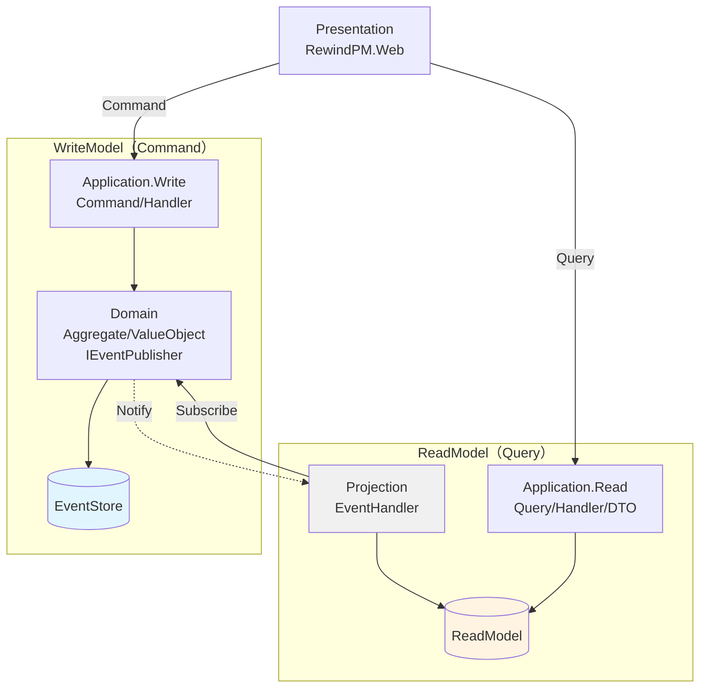
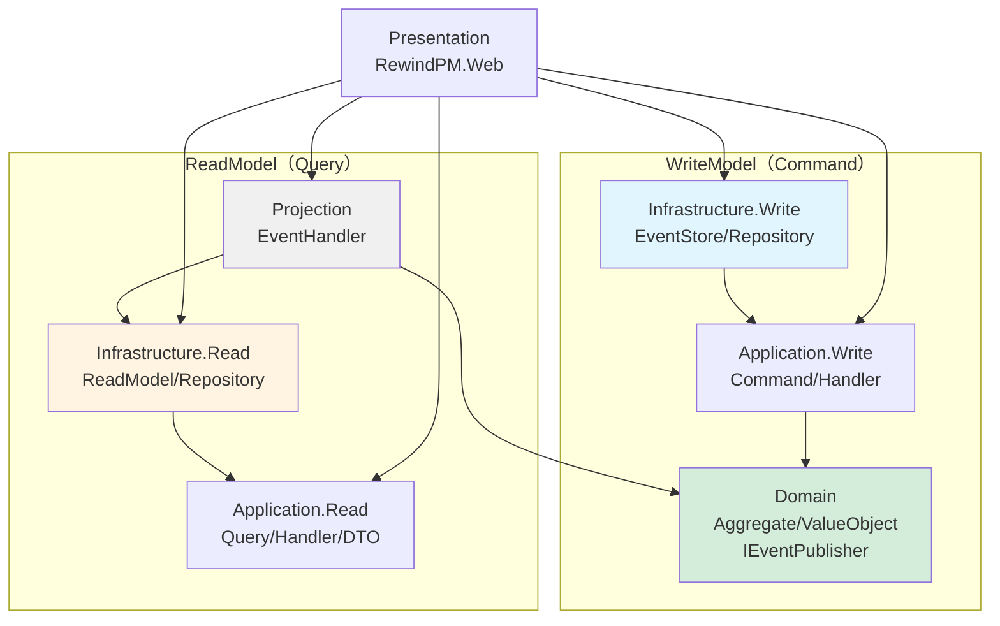

# RewindPM

時間を巻き戻せるプロジェクト管理ツール

RewindPMは、過去の任意の時点にさかのぼってプロジェクトの状態を確認できるプロジェクト管理ツールです。イベントソーシングアーキテクチャにより、すべての変更履歴を保持し、いつでも過去の状態を振り返ることができます。

## 主な機能

### リワインド機能（タイムトラベル）

プロジェクトの過去の状態を日付単位で確認できます。過去の計画と実績を比較したり、タスクの進捗推移を確認することで、プロジェクトの振り返りや改善に活用できます。

- 前後移動ボタン：編集があった日付を前後に移動
- スライダー操作：タイムライン上を直感的に移動
- カレンダーピッカー：特定の日付に直接ジャンプ

### プロジェクト管理

- 複数プロジェクトの管理：プロジェクトの作成、編集、削除
- タスク管理：タスクの作成、編集、ステータス管理
- カンバンボード：ステータスごとのカラム表示とドラッグ&ドロップ操作
- ガントチャート表示：予定と実績を視覚化

### 統計・分析機能

- バーンダウンチャート：残タスク数の推移（予定線と実績線）
- 累積フローダイアグラム：タスクステータスの推移を可視化
- 統計ダッシュボード：完了率、タスク統計、工数統計

## 特徴

### イベントソーシング

すべての変更を「イベント」として記録します。データの現在の状態だけでなく、「いつ」「何が」変更されたかの履歴をすべて保持するため、過去の任意の時点の状態を完全に再現できます。

### CQRS（Command Query Responsibility Segregation）

コマンド（書き込み）とクエリ（読み取り）を分離したアーキテクチャにより、高速な読み取りと履歴の完全な記録を両立しています。

### シンプルで軽量

SQLiteを使用し、複雑なデータベースサーバーのセットアップは不要です。個人や小規模チームでの利用に最適化されています。

## 動作環境

- .NET 10 SDK 以上
- 対応OS: Windows、macOS、Linux

## インストール・セットアップ

### ソースからのビルド

#### 1. リポジトリのクローン

```bash
git clone https://github.com/hmbl7graze/RewindPM.git
cd RewindPM
```

#### 2. アプリケーションの起動

```bash
dotnet run --project RewindPM.Web
```

または

```bash
cd RewindPM.Web
dotnet run
```

アプリケーションが起動すると、コンソールにURLが表示されます（例：`http://localhost:5000`）。ブラウザでそのURLにアクセスしてください。

#### 3. タイムゾーンの設定（任意）

`RewindPM.Web/appsettings.json` でタイムゾーンを設定できます。詳細は[タイムゾーン設定](#タイムゾーン設定)を参照してください。

### 開発者向け：.NET Aspireダッシュボードでの起動

開発時にダッシュボードを使用したい場合は、AppHostから起動できます：

```bash
dotnet run --project RewindPM.AppHost
```

.NET Aspireのダッシュボードが起動し、アプリケーションが準備できると自動的にブラウザでフロントエンドが開きます。

### バイナリ版

[Releases](https://github.com/hmbl7graze/RewindPM/releases)ページから最新版をダウンロードできます。

#### セキュリティ警告について

現在のリリースバイナリは**コード署名を行っていません**。初回起動時に以下の警告が表示される場合がありますが、これは正常な動作です：

**Windows の場合:**
- Windows SmartScreenによる「WindowsによってPCが保護されました」という警告が表示されます
- 「詳細情報」をクリック → 「実行」ボタンで起動できます

**macOS の場合:**
- Gatekeeperによる警告が表示されます
- 「システム設定」→「プライバシーとセキュリティ」から実行を許可できます

## 使い方

### プロジェクトの作成

1. ホーム画面で「新規プロジェクト作成」ボタンをクリック
2. プロジェクト名と説明を入力
3. 「作成」ボタンをクリック

### タスクの管理

1. プロジェクト一覧からプロジェクトをクリック
2. 「新しいタスク」ボタンでタスクを追加
3. ガントチャートまたはカンバンボードでタスクを管理
4. タスクをクリックして詳細を編集

### 過去の状態を確認（リワインド機能）

1. プロジェクト詳細画面上部のタイムラインコントロールを使用
2. 前後ボタン（◀ ▶）で編集があった日付を移動
3. カレンダーアイコンをクリックして特定の日付にジャンプ
4. スライダーをドラッグしてタイムラインを移動
5. 現在に戻るには「現在に戻る」ボタンをクリック

### ビューの切り替え

プロジェクト詳細画面では以下のビューを切り替えできます：

- ガントチャート：タスクのスケジュールを時系列で表示
- カンバンボード：ステータスごとにタスクを整理
- 統計ダッシュボード：プロジェクトの進捗を分析

## タイムゾーン設定

RewindPMは日単位でプロジェクトの振り返りを行うため、タイムゾーンの設定が重要です。

### 設定方法

`RewindPM.Web/appsettings.json` の `TimeZone` セクションで設定します：

```json
{
  "TimeZone": {
    "TimeZoneId": "Asia/Tokyo"
  }
}
```

### 利用可能なタイムゾーンID

RewindPMは.NETの標準タイムゾーンIDを使用します。プラットフォームによって使用可能なIDが異なります。

Windows環境：
- `UTC` - 協定世界時
- `Tokyo Standard Time` - 日本標準時 (JST, UTC+9)
- `Eastern Standard Time` - 米国東部時間
- `GMT Standard Time` - 英国時間

Linux/macOS環境（IANA形式）：
- `UTC` - 協定世界時
- `Asia/Tokyo` - 日本標準時 (JST, UTC+9)
- `America/New_York` - 米国東部時間
- `Europe/London` - 英国時間

## 技術スタック

### 基盤技術

- プラットフォーム: .NET 10 / C# 13
- フロントエンド: Blazor Server
- データベース: SQLite
- ORM: Entity Framework Core

### アーキテクチャパターン

- CQRS (Command Query Responsibility Segregation)
  - Write側とRead側を完全に分離
  - コマンド処理にMediatR v12を使用（MITライセンス）
  - EventStoreは永続的に保持、ReadModelは再作成可能な設計
  - タイムゾーン変更時など、ReadModelのみを削除して再構築できる
- イベントソーシング
  - Event StoreをSQLiteで実装
  - すべての変更をイベントとして永続化
  - イベント履歴から任意の時点の状態を再現可能
- レイヤードアーキテクチャ
  - Presentation層、Application層、Domain層、Infrastructure層、Projection層
- DDD (Domain-Driven Design)
  - Aggregate、Value Object、Domain Eventパターンの採用

### 開発・テスト

- テストフレームワーク: xUnit
- バリデーション: FluentValidation（Application層で使用）
- CI/CD: GitHub Actions

## プロジェクト構成

```
RewindPM/
├── RewindPM.AppHost/              # .NET Aspire ホストプロジェクト
├── RewindPM.Web/                  # Blazor Server UI (Presentation層)
│
├── RewindPM.Application.Write/    # Write側 Application層
│   ├── Commands/                  # コマンド定義
│   ├── CommandHandlers/           # コマンドハンドラー
│   └── Validators/                # バリデーション
│
├── RewindPM.Application.Read/     # Read側 Application層
│   ├── Queries/                   # クエリ定義
│   ├── QueryHandlers/             # クエリハンドラー
│   └── DTOs/                      # データ転送オブジェクト
│
├── RewindPM.Domain/               # Domain層
│   ├── Aggregates/                # 集約ルート
│   ├── ValueObjects/              # 値オブジェクト
│   └── Events/                    # ドメインイベント
│
├── RewindPM.Infrastructure.Write/ # Write側 Infrastructure層
│   ├── EventStore/                # イベントストア実装
│   └── Repositories/              # リポジトリ実装
│
├── RewindPM.Infrastructure.Read/  # Read側 Infrastructure層
│   ├── ReadModel/                 # 読み取りモデル
│   └── Repositories/              # クエリ実装
│
├── RewindPM.Projection/           # Projection層
│   └── EventHandlers/             # イベントハンドラー（EventStore → ReadModel）
│
└── *.Test/                        # 各プロジェクトの単体テスト
```

### アーキテクチャ構成図（CQRS + イベントソーシング）



### データフロー図

上記の図は**データフロー（処理の流れ）**を表現しています。

- コマンド実行: `UI → Application.Write → Domain → EventStore`
- イベント通知: `Domain → Projection → ReadModel`
- クエリ実行: `UI → Application.Read → ReadModel`

### 依存関係図（プロジェクト参照）



## 開発方針

- C#のベストプラクティスに準拠
- 依存関係の原則を厳守（Domain層は他層に依存しない）
- テスタビリティの重視
- すべての主要コンポーネントに対する単体テスト

## ライセンス

MIT License

Copyright (c) 2025 hmbl7graze

詳細は[LICENSE](LICENSE)ファイルを参照してください。
